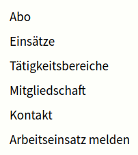
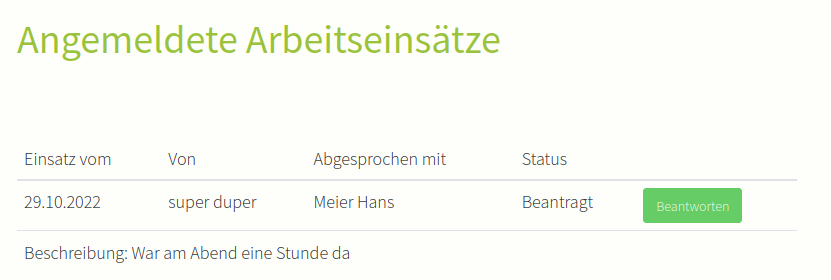
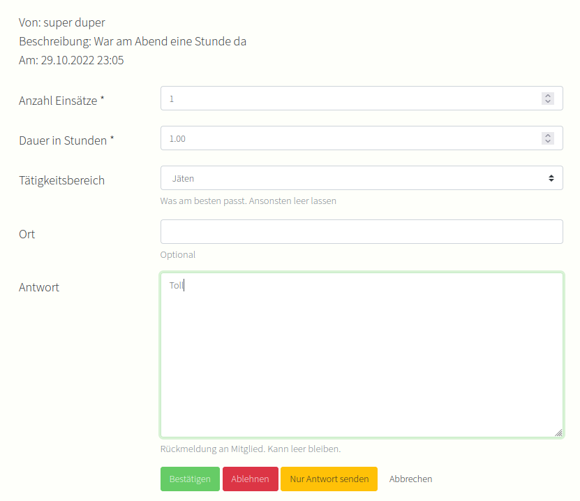
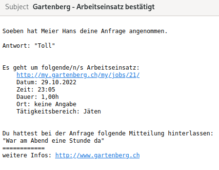
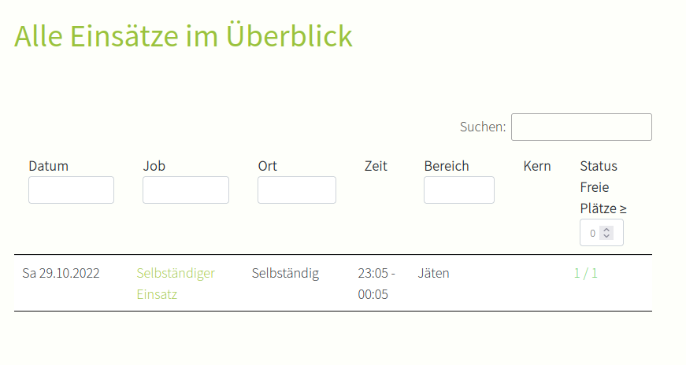

# juntagrico_assignment_request

[](https://github.com/juntagrico/juntagrico-assignment-request/actions/workflows/juntagrico-ci.yml)
[](https://codeclimate.com/github/juntagrico/juntagrico-assignment-request/maintainability)
[](https://codeclimate.com/github/juntagrico/juntagrico-assignment-request/test_coverage)
[](https://pypi.python.org/pypi/juntagrico_assignment_request)
[](https://pypi.python.org/pypi/juntagrico_assignment_request)
[](https://pypi.python.org/pypi/juntagrico_assignment_request)
[](https://pypi.python.org/pypi/juntagrico_assignment_request)
[](https://pypi.python.org/pypi/juntagrico_assignment_request/)
[](https://github.com/juntagrico/juntagrico-assignment-request)
[](https://github.com/juntagrico/juntagrico-assignment-request)

This is an extension for juntagrico. You can find more information about juntagrico here
(https://github.com/juntagrico/juntagrico)

It allows members to request assignments for jobs they have done, that were not announced.

## Installation

1. Add `juntagrico-assignment-request` to your `requirements.txt`
2. Add `'juntagrico_assignment_request',` to the `INSTALLED_APPS` in your `settings.py` **above** `juntagrico`
3. Add `path(r'', include('juntagrico_assignment_request.urls')),` at the end of your `urls.py`
4. Redeploy your project (and apply migrations)

## Configuration

When requesting an assignment, members can select the person (confirmer) that can confirm that they did a job.
To add people to this selection you will have to add this permission to that user: `juntagrico_assignment_request | Arbeitseinsatz Anfrage | Kann selbständige Arbeitseinsätze bestätigen`

If you want to allow an activity area coordinator to confirm requests, but only on the areas they coordinate,
add this permission to that user: `juntagrico_assignment_request | Arbeitseinsatz Anfrage | Kann selbständige Arbeitseinsätze im eigenen Tätigkeitsbereich bestätigen`

Only the selected confirmer, will be informed about the request by email and can see the request.

If members don't select any confirmer all users with the following permission will receive a notification and can see the request: `juntagrico_assignment_request | Arbeitseinsatz Anfrage | Wird über nicht abgesprochene Arbeitseinsätze informiert`

The [ASSIGNMENT_UNIT](https://juntagrico.readthedocs.io/en/latest/reference/settings.html#assignment-unit) setting is respected.

### ASSIGNMENT_REQUEST_AREAS

If you need to limit the activity areas that can be selected in the requests,
set this setting to a function, that takes an `ActivityArea` queryset as the first argument
and returns a filtered queryset.
By default, all activity areas can be selected.

Example: Include only visible activity areas:

```python
def only_visible(queryset):
    return queryset.filter(hidden=False)

ASSIGNMENT_REQUEST_AREAS = only_visible
```

## Usage

1. Members will see a new entry in the menu to request assignments
2. They are presented with a form to fill out the details of the job they did
3. Below the form, they see a list of assignments that they already sent with the option to edit or delete them
4. Upon sending the form, the selected confirmer (or the fallback users) will be informed by email
5. The confirmer can modify the assignment amount, accept, deny or just send a message to the member
    - For convenience, there is a one click option to confirm the assignment in the email
6. Once accepted, the member is informed, and an assignment is created

## Admin modifications

The extension creates job types and jobs on the fly behind the scenes as they are needed to create the assignments and show them to the member that made them.
In order to not clutter the admin views with automatically generated content, these jobs and job types are hidden.
As a side effect there will be assignments that have a valid job link, but when you follow that job, you will be told that no job with the given id exists.

## Screenshots

New menu entry



Request Form


Overview about reported assignments



Form to accept/deny the request



Confirmation by mail for the requester



The assignment appears in the list


